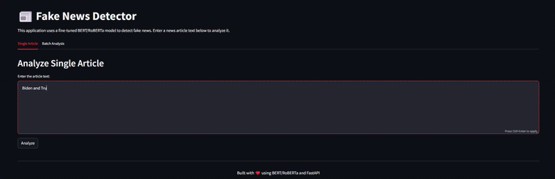

# Fake News Detector

A machine learning application that uses a fine-tuned RoBERTa model to detect fake news articles. The project includes both a training pipeline and a user-friendly web interface.

## Video example : 




## Try it at : https://fake-news-detector-c6qxugyq5xdofl6bxlxk5p.streamlit.app/


## Features

- Fine-tuned RoBERTa model for fake news detection
- FastAPI backend for model serving
- Streamlit web interface for easy interaction
- Cloud deployment support via Hugging Face Hub

## Project Structure

```
fake-news-detector/
├── api.py                 # FastAPI backend
├── app.py                 # Streamlit web interface
├── data_preprocessing.py  # Data preprocessing utilities
├── model.py              # Model definition and training logic
├── requirements.txt      # Project dependencies
├── streamlit_app_cloud.py # Cloud version of Streamlit app
└── upload_to_huggingface.py # Script to upload model to Hugging Face
```

## Setup

1. Clone the repository:
```bash
git clone https://github.com/Psantaniello24/FAKE-NEWS-DETECTOR.git
```

2. Create and activate a virtual environment:
```bash
python -m venv venv
source venv/bin/activate  # On Windows: venv\Scripts\activate
```

3. Install dependencies:
```bash
pip install -r requirements.txt
```

## Usage

### Training the Model

1. Prepare your dataset in CSV format with 'text' and 'label' columns
2. Run the training script:
```bash
python train.py --data_path path/to/your/dataset.csv
```

### Running the Web Interface

1. Start the FastAPI backend:
```bash
python api.py
```

2. Start the Streamlit interface:
```bash
streamlit run app.py
```


## Model Information

The model is based on RoBERTa, a robustly optimized BERT approach. It has been fine-tuned on a dataset of real and fake news articles to classify text as either "Real" or "Fake".


## License

This project is licensed under the MIT License - see the LICENSE file for details.

## Acknowledgments

- Hugging Face for the Transformers library
- Streamlit for the web interface framework
- FastAPI for the backend API 
